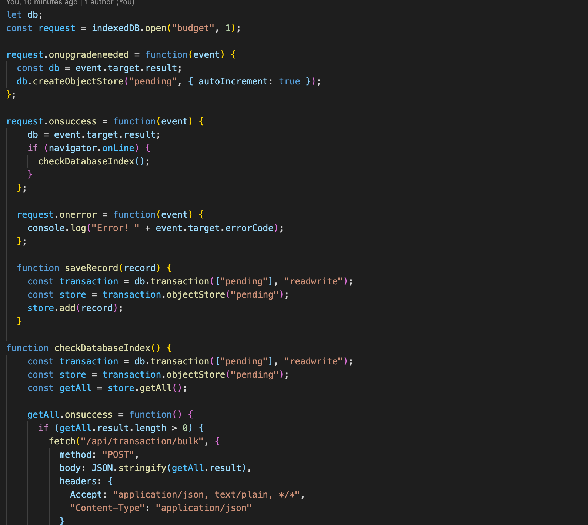
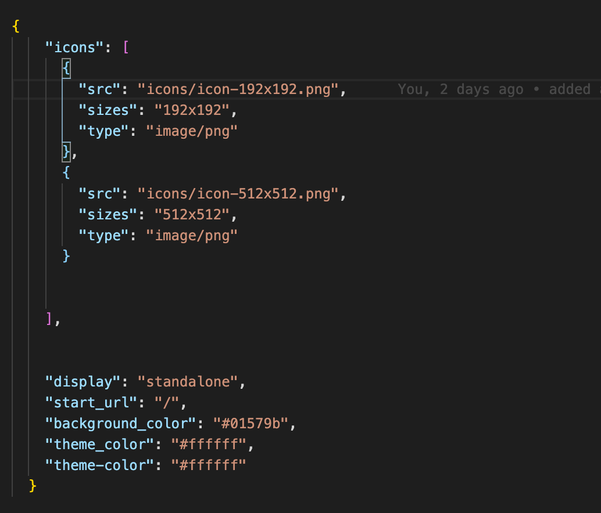
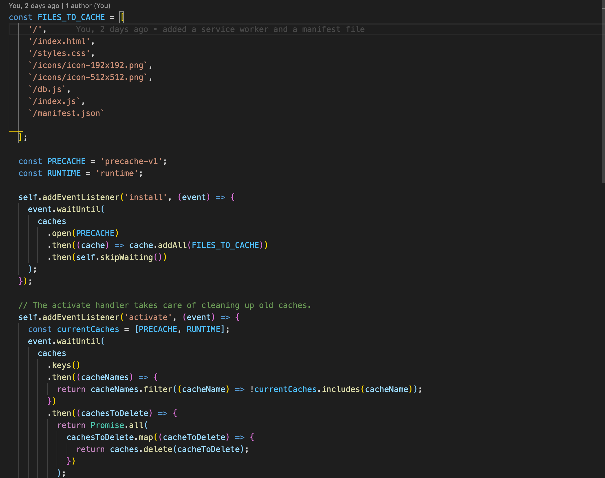
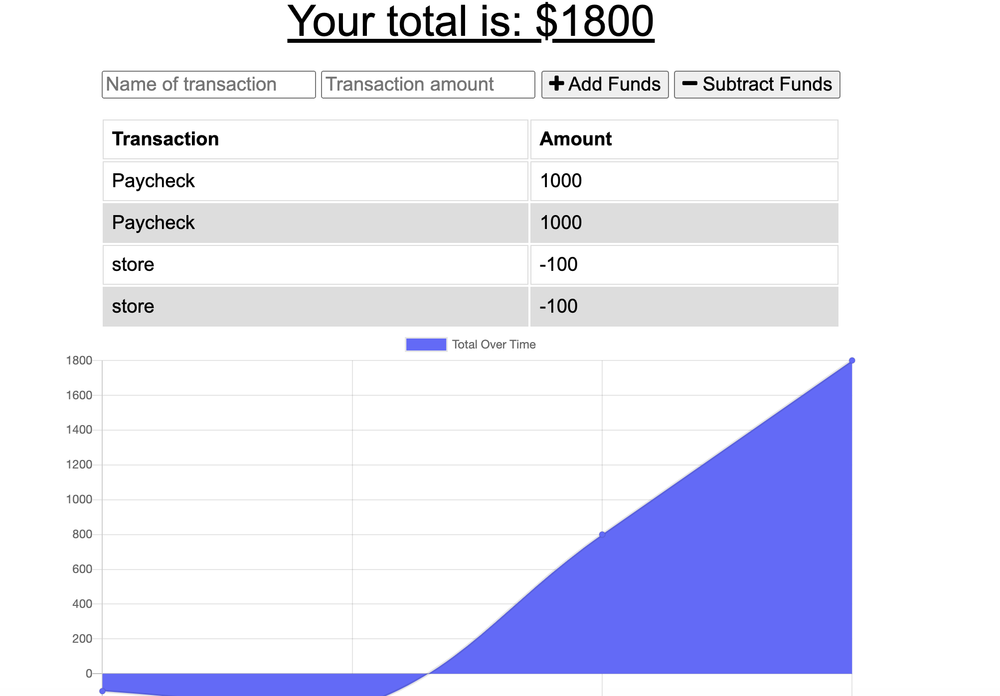

# Budget_Story

## Table of Contents

- [Locations](#locations)
- [Application Summary](#application-summary)
- [Contributors](#contributors)
- [Image of Sample Code](##Image-of-Sample-Code)
- [Image of Application](##Image-of-Application)
- [Credits](#Credits)
- [Questions](#Questions)
- [License](#license)

## Locations

Deployed Application Link:https://limitless-garden-69272.herokuapp.com/

GitHub Repository Link:https://github.com/LauraGwendolynBurch/Budget_Story

## Application Summary
An application that uses mongoose, express, compression and morgan to help you keep a budget on or offline.
## Contribution
Clone repo | Push changes | Create Pull request

## Image of sample code

## Image of Application 

## Credits
Anna Conover (tutor)

University of Washington Bootcamp TAs and Instructor

Study Group: Aaron Parnell, Keenan Reed, Sally Perez, Rattanak Leng

## Questions
GitHub Username: [LauraGwendolynBurch](https://github.com/LauraGwendolynBurch)

Email: <lauraburch.lb@gmail.com>
 
## License

    
    Copyright (C) 2021  Laura Gwendolyn Burch

    This program is free software: you can redistribute it and/or modify
    it under the terms of the GNU General Public License as published by
    the Free Software Foundation, either version 3 of the License, or
    (at your option) any later version.

    This program is distributed in the hope that it will be useful,
    but WITHOUT ANY WARRANTY; without even the implied warranty of
    MERCHANTABILITY or FITNESS FOR A PARTICULAR PURPOSE.  See the
    GNU General Public License for more details.

    You should have received a copy of the GNU General Public License
    along with this program.  If not, see <https://www.gnu.org/licenses/>.